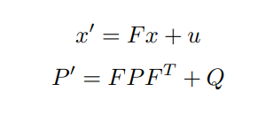

# CarND-Extended-Kalman-Filter-Project

This is a completed implementation of the extended kalman filter project for Udacity's Self-Driving 🚗 Nanodegree using Haskell. This project was made to be used with the [Udacity's Term 2 Self Driving Car Simulator](https://github.com/udacity/self-driving-car-sim/releases).

## Setup, Build and, Run

* Install [Haskell Tool Stack](https://docs.haskellstack.org/en/stable/README/)

```bash
stack build
stack exec ekf
```


# Project Writeup

## Basic Concept Of Kalman Filters

Kalman filters are a class of information filters that can filter noise from measurments. When given enough information kalman filters often produce useful estimations. The source of the information that kalman filters use come from mathematical models and sensor measurments. The sensor measurments that kalman filters update on need not be from one source. That is to say that a kalman filter may update it's belief based on sensor measurments of various types. This concept, of using multiple sources of information, is sometimes called sensor fusion or data fusion.

A kalman filter can be understood as having 2 components: a state space (x) and an error space (p). The state space is an estimate of the state we wish to know. For example, if we'd like to know the position of an object the state space may contain some `x, y, z` position values. Or, if we'd like to know the fuel level of a gas tank the state space may contain some `l` value representing the remaining liters of fuel in a tank. The error space represents the noise of the information. It is a space containing the covariance of the state. This space provides the certainty of belief of the filter's estimation.

The take away from this is:

* `x` is the state we wish to know.
* `p` is the certainty that we know it.

The kalman filter process can be described generally as having 2 steps. A prediction step and an update step. A prediction is made based on a mathematical model. So, if we were to predict what the fuel level of a gas tank would be we can use a mathematical model to calculate what we think the fuel level might be over time. The update step uses the prediction of the mathematical model and the information from a measurment to, hopefully, generate a more accurate belief about the state we wish to know.


## Intuition For The Need Of Linearity

## Outline Of Implementation

For this project a kalman filter using a constant velocity motion model will be implemented. At any given time we may receive either a lidar or radar sensor measurment. A lidar measurement provides a `x, y` position and, a radar measument provides a `rho, phi, rho'` radial velocity.

To design this filter we must design the equations for the prediction step. The generilzed equations for calculating prediction are:



`x` and `p` are the state and error spaces. `f` is the state transition matrix. `u` and `q` model the noise or uncertainty of our mathematical model. Our state vector, x, will be `[px, py, vx, xy]` In this case we will be using a linear constant velocity model. So, the equations for the transition between time steps in fairly simple.

* px = px + vx*dt
* py = py + vy*dt
* vx = vx
* vy = vy

So, our state transition matrix will be:

```haskell
f = (4><4) [1, 0, dt,  0,
            0, 1,  0, dt,
            0, 0,  1,  0,
            0, 0,  0,  1]
```